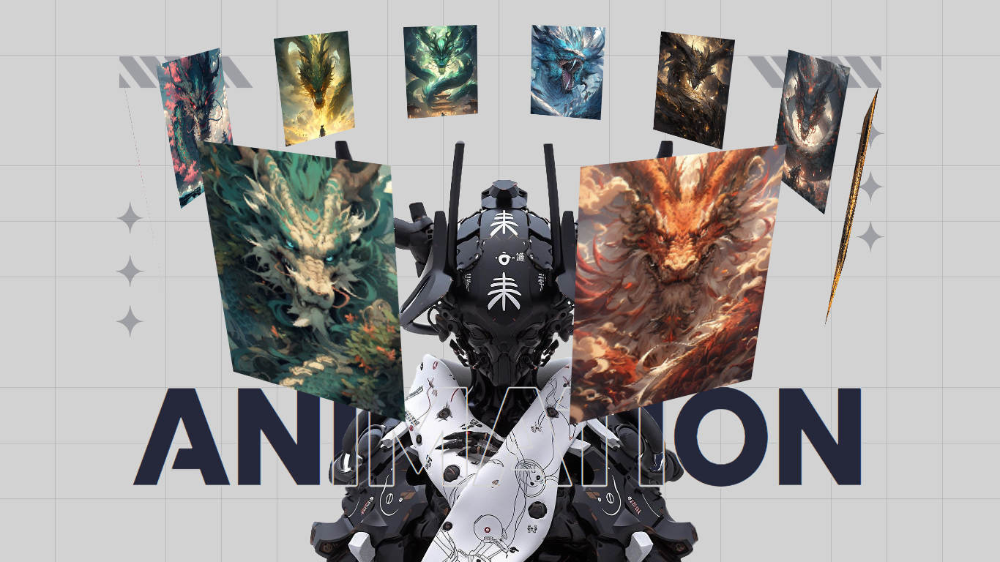

# CSS Only Animated Hero Section

A clean, lightweight hero section with smooth animations — built using pure CSS without JavaScript.

## 📖 Overview

This project demonstrates a responsive animated hero/banner section using only HTML and CSS.   
Perfect for landing pages, portfolios, or simple websites where you want to add subtle motion without relying on JavaScript or external libraries.

## 🚀 Features

- Pure CSS Animations
- Fully Responsive Layout
- No JavaScript Required
- Easy to Customize and Integrate

## 📄 License
> This project is licensed under the MIT License.
